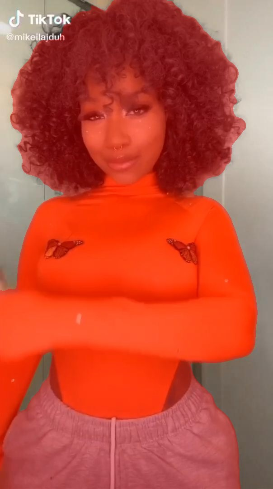

# UNet TikTok Segmentation Project

## Overview
This project focuses on training a UNet model for segmenting TikTok videos into different objects or regions of interest. The UNet architecture is a popular choice for image segmentation tasks due to its ability to capture fine-grained details while maintaining context.

## Data
To train the UNet model for TikTok video segmentation, you will need a labeled dataset of TikTok videos with pixel-level annotations for the objects or regions you want to segment. The dataset should include videos with corresponding ground truth masks highlighting the areas of interest. It's important to have a diverse dataset that covers various scenarios and conditions seen in TikTok videos. I used this dataset: https://www.kaggle.com/datasets/yasaminjafarian/tiktokdataset.

## Model Architecture
The UNet model architecture used in this project is based on the original UNet architecture with slight modifications to adapt it for video segmentation. UNet consists of an encoder part for feature extraction and a decoder part for generating segmentation masks. Skip connections between the encoder and decoder help preserve spatial information during upsampling.

## Training
1. Data Preparation: Prepare your dataset by extracting frames from TikTok videos and creating pixel-level masks for the objects you want to segment. Ensure that the images and masks are appropriately resized and aligned.

2. Model Configuration: Configure the UNet model architecture and adjust hyperparameters based on your project's needs. You'll need to specify the number of classes (objects or regions) you're segmenting, as well as other model-related parameters.

3. Training Process: Train the UNet model on your annotated TikTok video frames. During training, the model learns to generate accurate segmentation masks. The training process typically involves minimizing a loss function that quantifies the differences between predicted masks and ground truth masks.

4. Model Evaluation: Evaluate the trained model's performance using relevant segmentation metrics such as Intersection over Union (IoU), Dice coefficient, or pixel-wise accuracy. These metrics measure the model's ability to accurately segment the objects in TikTok videos.

5. Inference: Once the UNet model is trained and evaluated, you can use it for inference on new TikTok videos. The model will generate segmentation masks for the objects or regions of interest, allowing you to separate and analyze different parts of the videos.

## Usage
If you want to train the model with other parameters:
1. Go to folder with project and install virtualenv, write the following command and press Enter:
```bash
pip install virtualenv
```
2. Run pre_data_analysis.ipynb.
3. Next create a new environment, write the following command and press Enter:
```bash
virtualenv name_of_the_new_env
```
### Example:
```bash
virtualenv tiktok
```
4. Next activate the new environment, write the following command and press Enter:
```bash
name_of_the_new_env\Scripts\activate
```
### Example:
```bash
tiktok\Scripts\activate
```
5. Write the following command and press Enter:
 ```bash
pip install -r requirements.txt
```
6. In order to train the model you can use with the default parameters, you can execute the following command:
```bash
python train.py
```
In this case, the following parameter values will be used:
--root_dir_train=./data/train
--root_dir_val=./data/val
--root_dir_test=./data/test
--save_model_path=./models/
--epochs=10000
--lr=0.001 (learning rate)
--batch=16
You can also change the values of an arbitrary number of parameters, for example, you can train using the following command:
```bash
python train.py --root_dir_train ./path/to/train/images --batch 2
```


To use the trained UNet model for TikTok video segmentation, follow these steps:

1. Clone the repository: Open a terminal, navigate to the desired directory, and run:
```bash
git clone https://github.com/loipoi3/tiktok_segmentation.git
```
2. Next go to folder with project and run this command:
```bash
docker-compose up --build
```
3. And the last thing, open this link in your browser http://localhost:8501, that's all, now you can use the detector.

Example of the result of the model:



## Results
The performance of the UNet model can be evaluated using segmentation-specific metrics such as IoU or Dice coefficient. These metrics provide insights into how accurately the model segments objects in TikTok videos.

For training, I used the following parameters: learning rate = 0.001, batch size = 16, optimizer: Adam, number of epoch = 30, I used the following loss: SoftBCEWithLogitsLoss. After training, the validation dataset had the following loss and metrics:
val_loss: 0.0541, iou_score: 0.9496, f1_score: 0.9741, f2_score: 0.9776, accuracy: 0.9799, recall: 0.9799,
and on the test:
test_loss: 0.0632, iou_score: 0.9371, f1_score: 0.9674, f2_score: 0.9758, accuracy: 0.9745, recall: 0.9813.

You can see more about the losses and metrics for all epochs in the results.txt file.

## Conclusion
In this project, we developed a UNet model for segmenting TikTok videos into different objects or regions. By following the steps above, you can create your own TikTok video segmentation system using UNet. Remember to curate a diverse and well-annotated dataset, fine-tune the model architecture and hyperparameters, and thoroughly evaluate its performance for accurate segmentation.

Please refer to the project documentation and code for detailed implementation instructions and examples. Enjoy exploring and segmenting TikTok videos with your UNet model!

Please refer to the project documentation and code for detailed implementation instructions and examples. Happy detecting!

## Author
This UNet TikTok Segmentation project was developed by Dmytro Khar. If you have any questions or need further assistance, please contact qwedsazxc8250@gmail.com.
